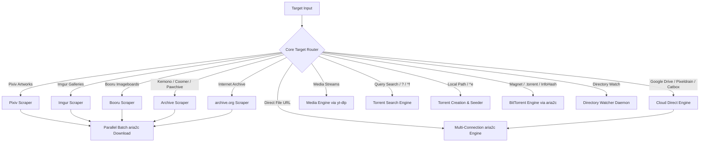

# Supported Sites & Routing Architecture

`anpan` inspects target inputs and automatically routes them to the appropriate extraction engine or download backend:

---

## 1. BitTorrent & P2P Ecosystem

### Torrent Search Across 7 Indexers
When a query is entered via `Ctrl+F` (`^f search torrent`), CLI `anpan search`, or prefix (`? query`, `search query`, `s query`), Anpan queries indexers concurrently:

| Indexer | Primary Categories | Protocol / API | Notes |
| :--- | :--- | :--- | :--- |
| **SubsPlease** | Anime | REST JSON API (`subsplease.org/api`) | High-speed releases, automated batch resolution extraction |
| **Nyaa** | Anime, Japanese Games, Audio | RSS XML API with fast mirror fallback (`nyaa.net` / `nyaa.si`) | Rich seeder counts, human-readable file sizes parsed accurately |
| **YTS** | Movies | REST JSON API (`yts.mx/api/v2`) | 720p, 1080p, and 4K movie releases with health stats |
| **EZTV** | TV Shows | REST JSON API (`eztv.re/api`) | Episodic releases with flexible JSON type decoding |
| **The Pirate Bay** | All, Anime, Movies, TV, Games | Clean REST API (`apibay.org`) | Broad historical releases, dedicated category top 100 browse |
| **1337x** | Movies, TV, Games | Scraped HTML parser with mirror failover | Multi-category coverage, verified uploaders |
| **FitGirl Repacks** | Verified PC Game Repacks | RSS XML Feed (`fitgirl-repacks.site/feed`) | Highly compressed, trusted, verified game repacks |

### Bare InfoHash & Torlink Support
- Paste any raw **40-character hex** (e.g. `8df6e26142615621983763b729f640372cf1fc34`) or **32-character Base32** InfoHash into Anpan.
- Anpan automatically normalizes the hash, builds a valid magnet URI, injects Tier-1 public trackers, and launches download via `aria2c`.

### Pure Go Torrent Creation & Seeding
- Converts any local file or directory into a valid bencoded `.torrent` file using pure Go (`crypto/sha1`).
- Dynamically selects optimal piece lengths (256 KB up to 4 MB).
- Injects public Tier-1 BitTorrent trackers (`opentrackr`, `openbittorrent`, `demonii`, `stealth.si`).
- Launches active P2P DHT seeding with live upload progress, seeder counts, and seed ratio tracking.

### Automated Directory Watcher Daemon (`anpan watch`)
- Monitors a designated folder for incoming `.torrent`, `.magnet`, `.txt`, or `.link` files.
- Downloads files in the background, moves finished items to `.processed/`, and triggers desktop alerts.

---

## 2. Art & Illustration

### Pixiv
- **Supported URLs**:
  - `https://www.pixiv.net/artworks/{id}`
  - `https://www.pixiv.net/en/artworks/{id}`
  - `https://www.pixiv.net/i/{id}`
- **Extraction Mechanism**:
  - Fetches post metadata and multi-page image URLs via Pixiv internal AJAX endpoints.
  - Sends appropriate `Referer` headers to download original full-resolution master files via `aria2c`.
  - Multi-page sets are automatically saved in organized subfolders (`~/Downloads/[Artist] Title/`).

### Imgur
- **Supported URLs**:
  - `https://imgur.com/a/{id}`
  - `https://imgur.com/gallery/{id}`
- **Extraction Mechanism**:
  - Queries Imgur API endpoints to parse full gallery images and videos.
  - Downloads all files concurrently via `aria2c` into a designated gallery folder.

### Booru Imageboards
- **Supported Sites**:
  - `yande.re/post/show/{id}`
  - `konachan.com/post/show/{id}`
  - `safebooru.org/index.php?page=post&s=view&id={id}`
  - `gelbooru.com/index.php?page=post&s=view&id={id}`
- **Extraction Mechanism**:
  - Queries native JSON API endpoints to fetch raw, uncompressed source artwork files directly.

---

## 3. Archive Hubs & Digital Libraries

### Kemono, Coomer, Pawchive
- **Supported URLs**:
  - `https://kemono.cr/{service}/user/{userId}/post/{postId}` (also `.su`, `.party`)
  - `https://coomer.st/{service}/user/{userId}/post/{postId}` (also `.su`, `.party`)
  - `https://pawchive.pw/{service}/user/{userId}/post/{postId}` (also `.st`)
- **Extraction Mechanism**:
  - Parses post metadata and all attached media files via `/api/v1/...`.
  - Generates primary and mirror download endpoints to avoid 404s or rate limits.
  - Displays an interactive multi-file selection checklist in the TUI (`Space` to toggle, `a` for select-all).

### Internet Archive (archive.org)
- **Supported URLs**:
  - `https://archive.org/details/{identifier}`
- **Extraction Mechanism**:
  - Queries `https://archive.org/metadata/{identifier}` to inspect available files, sizes, and formats.
  - Extracts direct HTTPS download links with 16-connection parallel chunk acceleration.

---

## 4. Cloud Hosts & Direct Links

### Google Drive
- **Supported URLs**: `drive.google.com/file/d/{id}/view`, `drive.google.com/open?id={id}`, `drive.google.com/uc?id={id}`
- **Mechanism**: Resolves direct download endpoints and injects `confirm=t` tokens to bypass the large-file virus scan interstitial screen, accelerating downloads via `aria2c`.

### MediaFire
- **Supported URLs**: `mediafire.com/file/{id}/...`
- **Mechanism**: Resolves raw CDN direct links from page metadata and downloads directly via `aria2c`.

### Pixeldrain
- **Supported URLs**:
  - Single file: `pixeldrain.com/u/{id}`
  - Album / List: `pixeldrain.com/l/{id}`
- **Mechanism**:
  - Single files stream directly from `/api/file/{id}?download`.
  - Lists and albums are automatically parsed via `/api/list/{id}` and downloaded as multi-file batches into a folder.

### Catbox / Litterbox
- **Supported URLs**: `files.catbox.moe/...`, `litterbox.catbox.moe/...`
- **Mechanism**: Direct high-speed multi-connection downloads via `aria2c`.

---

## 5. Media Streams (via `yt-dlp`)

Backend: `yt-dlp` + `ffmpeg`.

- **Supported Platforms**: YouTube, YouTube Music, SoundCloud, Bandcamp, TikTok, Instagram, Threads, X (Twitter), Twitch, Bilibili, Vimeo, Reddit, and over 1,800+ sites supported by `yt-dlp`.
- **Advanced Features**:
  - **Video Codecs**: Select between `auto`, `av1`, `vp9`, and `avc`.
  - **Audio Extraction**: Clean conversion to `mp3`, `m4a`, `opus`, `flac`, or `wav` with embedded metadata and cover artwork.
  - **Synchronized Lyrics**: Automatic download and generation of timestamped `.lrc` lyrics files.
  - **SponsorBlock**: Automatic removal or marking of sponsored segments.
  - **Timestamp Trimming**: Download only portions of streams by appending time ranges (e.g. `01:20-03:45`).
