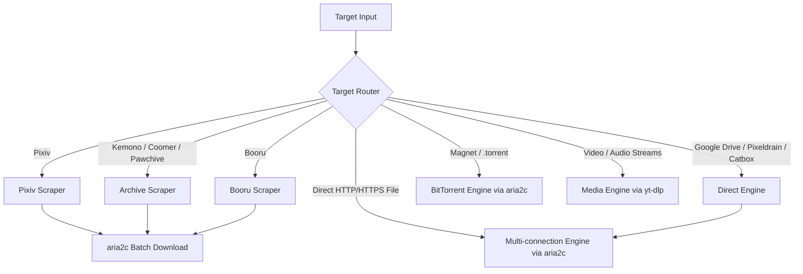

# Supported Sites & Routing Architecture

`anpan` inspects target inputs and routes them to the appropriate download engine:

---

## 1. Art & Illustration

### Pixiv
- **URL patterns**:
  - `https://www.pixiv.net/artworks/{id}`
  - `https://www.pixiv.net/en/artworks/{id}`
  - `https://www.pixiv.net/i/{id}`
- **Behavior**:
  - Queries `https://www.pixiv.net/ajax/illust/{id}` for metadata.
  - Queries `https://www.pixiv.net/ajax/illust/{id}/pages` for multi-page posts.
  - Passes `Referer: https://www.pixiv.net/` to download original resolution images via `aria2c`.
  - Saves multi-page sets in `~/Downloads/[Artist] Title/`.

### Imgur
- **URL patterns**:
  - Albums / Galleries: `https://imgur.com/a/{id}`, `https://imgur.com/gallery/{id}`
- **Behavior**:
  - Queries Imgur public API to extract all images and videos at original quality, downloaded in parallel via `aria2c` to a subfolder.

### Imageboards (Booru)
- **Supported sites**:
  - `yande.re/post/show/{id}`
  - `konachan.com/post/show/{id}`
  - `safebooru.org/index.php?page=post&s=view&id={id}`
  - `gelbooru.com/index.php?page=post&s=view&id={id}`
- **Behavior**:
  - Queries the respective site JSON API to fetch raw uncompressed image URLs.

---

## 2. Archive Hubs & Digital Libraries

### Kemono, Coomer, Pawchive
- **URL patterns**:
  - `https://kemono.cr/{service}/user/{userId}/post/{postId}` (also `.su`, `.party`)
  - `https://coomer.st/{service}/user/{userId}/post/{postId}` (also `.su`, `.party`)
  - `https://pawchive.pw/{service}/user/{userId}/post/{postId}` (also `.st`)
- **Behavior**:
  - Queries `/api/v1/{service}/user/{userId}/post/{postId}`.
  - Extracts main file and attachments.
  - Generates primary and mirror download URLs for failover with `aria2c`.
  - Displays multi-file selection menu in TUI.

### Internet Archive (archive.org)
- **URL patterns**:
  - `https://archive.org/details/{id}`
- **Behavior**:
  - Queries `https://archive.org/metadata/{id}` to parse metadata and files.
  - Generates direct HTTPS links for software, audio, books, videos, and ISOs with 16-connection parallel acceleration.

---

## 3. Cloud & File Hosts

### Google Drive
- **URL patterns**:
  - `https://drive.google.com/file/d/{id}/view`
  - `https://drive.google.com/open?id={id}`
  - `https://drive.google.com/uc?id={id}`
- **Behavior**:
  - Rewrites to direct download stream with `confirm=t` to bypass the large file virus scan screen, downloaded via `aria2c` with 16 connections.

### MediaFire
- **URL patterns**:
  - `https://www.mediafire.com/file/{id}/...`
- **Behavior**:
  - Resolves direct media CDN download URL and accelerates via `aria2c`.

### Pixeldrain
- **URL patterns**:
  - Single file: `https://pixeldrain.com/u/{id}`
  - Album / List: `https://pixeldrain.com/l/{id}`
- **Behavior**:
  - Single file: Queries `/api/file/{id}/info` for name/size, streams directly from `/api/file/{id}?download`.
  - Album/List: Queries `/api/list/{id}` to extract all files, downloaded as a multi-file batch to a subfolder.

### Catbox / Litterbox
- **URL patterns**:
  - `https://files.catbox.moe/...`
  - `https://litterbox.catbox.moe/...`
- **Behavior**:
  - Handled as direct file downloads via `aria2c`.

---

## 4. Media Streams

Backend: `yt-dlp` + `ffmpeg`.

- **YouTube / YouTube Music**: Codec selection (AV1, VP9, AVC), audio extraction, chapters, subtitles, SponsorBlock, browser cookies.
- **SoundCloud / Bandcamp**: Audio extraction with ID3 tags and cover embedding.
- **TikTok / Instagram / Threads / X / Twitch / Bilibili / Vimeo / Reddit**: Video/audio stream extraction.
- **+1,800 other sites** supported by yt-dlp.

---

## 5. BitTorrent

Backend: `aria2c`.

- **Formats**: Magnet URIs (`magnet:?xt=...`), `.torrent` files or URLs.
- **Features**: DHT, PEX, seed/peer tracking, automatic exit on complete.
